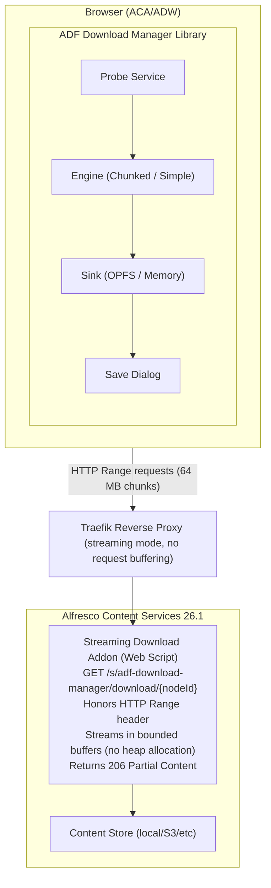

# ADF Download Manager

> A queue-based download/upload manager for Alfresco Content Application (ACA) that reliably handles **files of any size**

[](https://opensource.org/licenses/Apache-2.0)

## The Problem

Out-of-the-box Alfresco Content Services has a **~1 GB download ceiling** for single files. This limitation was documented at [Alfresco DevCon 2018](https://www.slideshare.net/slideshow/moving-gigantic-files-into-and-out-of-the-alfresco-repository/86521045): downloads of large files fail because ACS allocates the entire file in heap memory, causing an out-of-memory exception around 1 GB.

This affects users working with:

- CAD files and engineering documents
- High-resolution video and media assets
- Large datasets and backups
- Multi-gigabyte archives

## The Solution

The ADF Download Manager overcomes this limitation with a **two-part architecture**:

### 1. Server-Side: Streaming Download Addon

A lightweight ACS repository addon that provides a streaming endpoint supporting HTTP `Range` requests. Files are streamed from the content store in small buffers, keeping heap memory usage flat regardless of file size.

**Repository:** [alfresco-download-streaming-repo](https://github.com/aborroy/alfresco-download-streaming-repo)

### 2. Client-Side: ADF Frontend Library

An Angular library for ACA/ADW that provides:

- **Chunked downloads**: splits large files into manageable pieces (64 MB by default)
- **OPFS disk staging**: streams directly to disk via the File System Access API, avoiding browser heap pressure
- **Queue management**: download multiple files concurrently with configurable parallelism
- **Pause & resume**: supports resumable downloads using HTTP Range requests and ETag validation
- **Progress tracking**: real-time progress, speed, and ETA for each download
- **Automatic fallback**: works with or without the streaming addon

**Source:** [adf-download-manager/](adf-download-manager)

## Quick Start

Start the demo stack:

```bash
cd deployment
docker compose up --build
```

This command builds and starts:

- Alfresco Content Services 26.1 with the streaming addon
- Alfresco Content App with the download manager integrated
- Supporting services (PostgreSQL, Solr, ActiveMQ, Transform)

Access the application:

[http://localhost:8080](http://localhost:8080)

* Login: `admin` / `admin`

Test the large-file download feature:

1. Upload a large test file (or create one with `dd if=/dev/urandom of=test-large.bin bs=1m count=4096`)
2. Right-click the file -> **Add to Download Manager**
3. Watch the Downloads panel (right sidebar) show progress, speed, and ETA
4. Try **pausing** and **resuming** the download
5. Test downloading multiple files simultaneously

For detailed setup instructions, see [GETTING-STARTED.md](GETTING-STARTED.md).

## Architecture



Key Components:

1. **Probe Service**: Detects addon availability, file size, Range support via pre-flight HEAD request
2. **Engine**: Selects chunked (for large files) or simple (for small files) download strategy  
3. **Sink**: OPFS disk-backed for large files; memory buffer for small files (with safety cap)
4. **Queue**: Manages parallel downloads, persists paused/queued tasks to localStorage

For detailed architecture documentation, see [adf-download-manager/ARCHITECTURE.md](adf-download-manager/ARCHITECTURE.md).

## Integration into Your Project

Want to add large-file download support to your own ACA or ADW application?

See the **[Integration Guide](INTEGRATION-GUIDE.md)** for step-by-step instructions.

Quick summary:

1. Install the repository addon (JAR) into your ACS deployment
2. Add the library source to your Angular project
3. Register the provider in your app configuration
4. Configure assets (i18n, plugin JSON)

The library works **with or without** the streaming addon:

- **With addon:** Preferred: uses server-side streaming for maximum reliability
- **Without addon:** Falls back to chunked Range requests against standard ACS content API

## Components

### Repository Addon

- **Repository:** [alfresco-download-streaming-repo](https://github.com/aborroy/alfresco-download-streaming-repo) (separate GitHub project, not part of this repository)
- **Type:** ACS repository JAR (web script)
- **License:** Apache 2.0
- **Installation:** Download the JAR from its [releases page](https://github.com/aborroy/alfresco-download-streaming-repo/releases), then drop it in `$TOMCAT_DIR/webapps/alfresco/WEB-INF/lib/` or bake it into your Docker image

### Frontend Library

- **Location:** `adf-download-manager/`
- **Type:** Angular 17+ standalone library
- **Framework:** ADF 6.x, Angular Material 17+
- **State Management:** RxJS BehaviorSubject (no external store required)
- **Status:** Source-only (npm package publication planned)

### Deployment Stack

- **Location:** `deployment/`
- **Purpose:** Complete Docker Compose demo environment
- **Components:** ACS, ACA, Traefik, PostgreSQL, Solr, ActiveMQ, Transform
- **Usage:** `docker compose up --build`

### Host Application

- **Location:** `aca/`
- **Purpose:** Full Alfresco Content App with library integrated
- **Branch:** `develop` (latest ACA)
- **Usage:** Reference implementation showing how to integrate the library

## Requirements

### For Running the Demo

- Docker Desktop with 7 GB RAM available
- 5-10 GB disk space
- Modern browser (Chrome, Firefox, Safari 16+, Edge)

### For Integration

- Angular 17+
- ADF 6.x
- Angular Material 17+
- TypeScript 5.x
- Node.js 24.x (for build)

### Browser Requirements

- **Required:** Fetch API, Streams API
- **Recommended:** OPFS (Origin Private File System) for disk-backed downloads
- **Fallback:** In-memory buffer with 900 MB cap for browsers without OPFS

## Features

**Large File Support**  
Download files of any size reliably: limited only by disk space and browser storage quota

**Pause & Resume**  
Stop and restart downloads; partial bytes are preserved on disk

**Queue Management**  
Download multiple files concurrently (configurable parallelism)

**Progress Tracking**  
Real-time progress bar, speed (MB/s), ETA, and downloaded/total size

**ZIP Downloads**  
Multi-select files or folders -> download as ZIP (polls ACS async API)

**Persistence**  
Paused and queued downloads survive page reloads (localStorage)

**Error Handling**  
Automatic retry with exponential backoff for transient network errors

**Session Recovery**  
Detects expired auth sessions, pauses downloads, resumes after re-login

**Browser Compatibility**  
Works on all modern evergreen browsers with graceful degradation

## Configuration

The library accepts a configuration object via `DOWNLOAD_MANAGER_CONFIG` token:

```typescript
import { DOWNLOAD_MANAGER_CONFIG } from '@alfresco/adf-download-manager';

{
  provide: DOWNLOAD_MANAGER_CONFIG,
  useValue: {
    maxParallelDownloads: 3,              // Concurrent downloads (default: 3)
    largeSizeThreshold: 104_857_600,      // 100 MB: use chunked mode above this
    chunkSizeBytes: 67_108_864,           // 64 MB: chunk size for Range requests
    warnSizeThreshold: 2_147_483_648,     // 2 GB: confirm before starting
    blockSizeThreshold: null,             // null = unlimited (with disk sink)
    inMemoryMaxBytes: 943_718_400,        // 900 MB: memory cap for no-OPFS browsers
    retryDelayMs: 2000,                   // Initial retry delay
    retryMaxDelayMs: 30_000,              // Max retry delay
    retryMaxAttempts: 5,                  // Max retry attempts
    useStreamingAddon: true,              // Detect and prefer addon endpoint
    zipPollIntervalMs: 3000,              // ZIP polling interval
    requestPersistentStorage: true        // Request OPFS eviction protection
  }
}
```

See [adf-download-manager/README.md](adf-download-manager/README.md) for complete configuration reference.

## Documentation

- **[GETTING-STARTED.md](GETTING-STARTED.md)**: Step-by-step tutorial with screenshots
- **[INTEGRATION-GUIDE.md](INTEGRATION-GUIDE.md)**: How to integrate into your ACA/ADW project
- **[CLAUDE.md](CLAUDE.md)**: Technical reference for contributors
- **[adf-download-manager/ARCHITECTURE.md](adf-download-manager/ARCHITECTURE.md)**: Library architecture deep-dive
- **[alfresco-download-streaming-repo](https://github.com/aborroy/alfresco-download-streaming-repo)**: Repository addon project (separate repository) and its installation guide
- **[deployment/README.md](deployment/README.md)**: Docker Compose stack documentation

## Roadmap

- [ ] Publish library to npm as `@alfresco/adf-download-manager`
- [ ] Parallel chunk downloads (v2 feature: download N chunks concurrently)
- [ ] Upload queue with resume support
- [ ] Drag-and-drop large file upload
- [ ] Background download service worker
- [ ] Desktop notification on completion

## Contributing

Contributions welcome! This project follows the standard GitHub workflow:

1. Fork the repository
2. Create a feature branch
3. Make your changes
4. Test thoroughly
5. Submit a pull request

See [CLAUDE.md](CLAUDE.md) for development setup and architecture.

## Credits

Inspired by findings from Alfresco DevCon 2018 talk *"Moving Gigantic Files In & Out of the Repository"* by Jeff Potts (Metaversant), which identified the ~1 GB ceiling and advocated for server-side streaming solutions