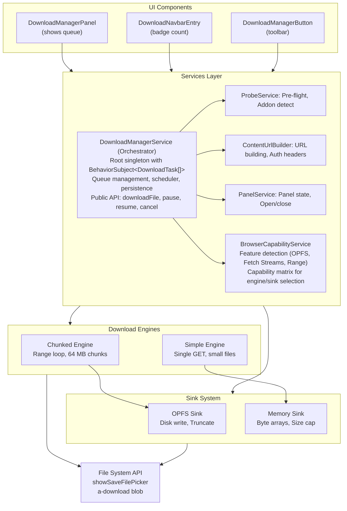
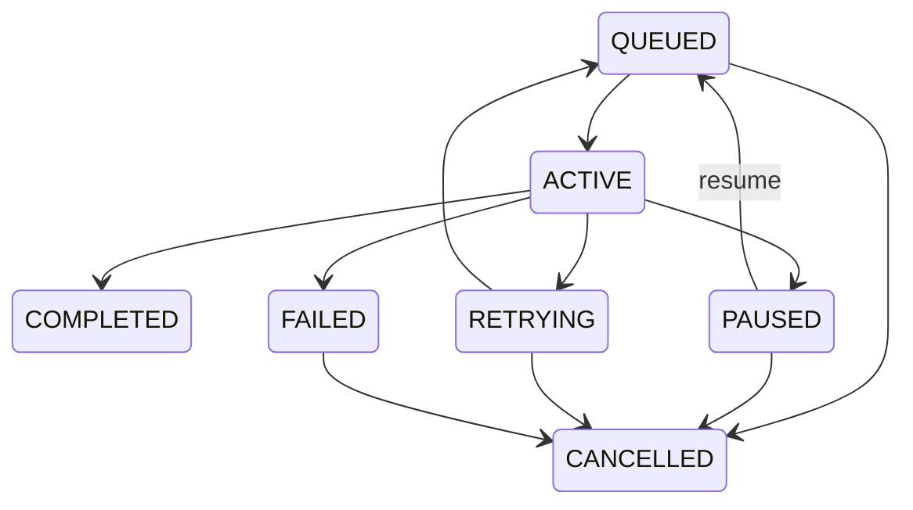

# ADF Download Manager - Architecture

This document provides a deep-dive into the internal architecture of the ADF Download Manager library.

## Overview

The ADF Download Manager is a **service-oriented architecture** built on Angular 17+ with RxJS for reactive state management. It uses **no external state management library** (no NgRx store for internal state-only effects for extension integration).

**Design Principles:**

1. **Separation of concerns**: Services orchestrate, engines execute, sinks persist
2. **Testability**: Pure logic in engines/sinks with no DOM dependencies
3. **Progressive enhancement**: Feature detection enables graceful degradation
4. **Immutable state**: Task queue is immutable; updates create new arrays
5. **Injection seams**: `fetchFn` allows mocking HTTP in tests

## Component Diagram



## Data Flow

### 1. Download Initiation

```typescript
// User clicks "Download" -> Extension action -> Effect -> Service
downloadFile(nodeId: string, fileName: string, totalBytes: number): string {
  // 1. Build task
  const task: DownloadTask = {
    id: generateId(),
    nodeId,
    fileName,
    totalBytes,
    downloadedBytes: 0,
    status: 'queued',
    type: 'node',
    rangeSupported: null,  // Unknown until probe
    etag: null,
    tempFileName: null,
    error: undefined,
    speedBytesPerSec: 0,
    startedAt: null
  };
  
  // 2. Add to queue (immutably)
  this.queue$.next([...this.queue$.value, task]);
  
  // 3. Persist to localStorage
  this.persist();
  
  // 4. Schedule (may start immediately if slots available)
  this.scheduleNext();
  
  return task.id;
}
```

### 2. Probe Phase

```typescript
// Before first byte, gather intelligence
async startTask(taskId: string): Promise<void> {
  // 1. Probe file metadata
  const node = await GET /nodes/{nodeId}
  const size = node.entry.content.sizeInBytes;
  
  // 2. Detect addon
  const addonAvailable = await this.detectAddon();
  
  // 3. Probe download endpoint
  const probe = await this.probeService.probe(nodeId, addonAvailable);
  
  // 4. Update task with probe results
  this.updateTask(taskId, {
    totalBytes: probe.totalBytes,
    rangeSupported: probe.rangeSupported,
    etag: probe.etag
  });
  
  // 5. Select engine and start download
  if (probe.totalBytes > largeSizeThreshold) {
    await runChunkedDownload(task, ...);
  } else {
    await runSimpleDownload(task, ...);
  }
}
```

### 3. Chunked Download Loop

```typescript
async runChunkedDownload(task, config, sink, ...): Promise<void> {
  let offset = task.downloadedBytes || 0;
  
  while (offset < task.totalBytes) {
    // Check if paused/cancelled
    const status = getTaskStatus(task.id);
    if (status === 'paused' || status === 'cancelled') {
      break;
    }
    
    // Fetch next chunk with Range header
    const end = Math.min(offset + chunkSizeBytes - 1, task.totalBytes - 1);
    const response = await fetch(url, {
      headers: { 'Range': `bytes=${offset}-${end}` }
    });
    
    // Handle 206 Partial Content
    if (response.status === 206) {
      // Reconcile total (detect file changes)
      const serverTotal = parseContentRangeTotal(response.headers);
      if (serverTotal && serverTotal !== task.totalBytes) {
        throw new FileChangedError();
      }
      
      // Stream to sink
      await pumpToSink(response.body, sink, (bytes) => {
        updateProgress(task.id, offset + bytes);
      });
      
      offset = end + 1;
    } else {
      throw new Error(`Unexpected status ${response.status}`);
    }
  }
  
  // Complete
  const result = await sink.close();
  saveFile(result, task.fileName);
  updateTask(task.id, { status: 'completed' });
}
```

### 4. Stream Pump (Chunk -> Sink)

```typescript
async pumpToSink(
  stream: ReadableStream,
  sink: DownloadSink,
  onProgress: (bytes: number) => void
): Promise<void> {
  const reader = stream.getReader();
  let accumulatedBytes = 0;
  
  try {
    while (true) {
      const { done, value } = await reader.read();
      if (done) break;
      
      // Write to sink (OPFS or memory)
      await sink.write(value);
      
      // Update progress AFTER successful write
      accumulatedBytes += value.byteLength;
      onProgress(accumulatedBytes);
    }
  } finally {
    reader.releaseLock();
  }
}
```

## Services Layer

### DownloadManagerService

**Responsibility:** Orchestrator-owns the queue, scheduler, and public API.

**State:**
```typescript
private readonly queue$ = new BehaviorSubject<DownloadTask[]>([]);
readonly tasks$ = this.queue$.asObservable();  // Public read-only stream
```

**Key Methods:**

| Method | Purpose |
|--------|---------|
| `downloadFile()` | Add file download to queue |
| `downloadZip()` | Add ZIP download (polls async API) |
| `pause()` | Abort fetch, set status to 'paused', persist |
| `resume()` | Validate ETag, verify offset, re-queue |
| `cancel()` | Abort, delete temp file, remove from queue |
| `retry()` | Reset progress, re-queue failed task |
| `pauseAll()` / `resumeAll()` | Bulk operations |
| `clearCompleted()` | Remove completed/cancelled from queue |

**Scheduler:**
```typescript
private scheduleNext(): void {
  const active = this.queue$.value.filter(t => t.status === 'active').length;
  const slots = this.config.maxParallelDownloads - active;
  const queued = this.queue$.value.filter(t => t.status === 'queued').slice(0, slots);
  
  queued.forEach(t => void this.startTask(t.id));
}
```

**Persistence:**
```typescript
private persist(): void {
  const restorable = this.queue$.value
    .filter(t => t.status === 'paused' || t.status === 'queued')
    .map(t => ({
      id: t.id,
      nodeId: t.nodeId,
      fileName: t.fileName,
      totalBytes: t.totalBytes,
      downloadedBytes: t.downloadedBytes,
      status: t.status,
      etag: t.etag,
      tempFileName: t.tempFileName,
      rangeSupported: t.rangeSupported,
      // DO NOT PERSIST: tokens, speedBytesPerSec, startedAt
    }));
  
  localStorage.setItem(STORAGE_KEY, JSON.stringify({
    version: STORAGE_VERSION,
    tasks: restorable
  }));
}
```

### ProbeService

**Responsibility:** Pre-flight checks to gather download intelligence.

**Key Method:**
```typescript
async probe(nodeId: string, useAddon: boolean): Promise<ProbeResult> {
  // 1. Get authoritative size from Nodes API (fast 403/404)
  const node = await this.nodesApi.getNode(nodeId);
  const totalBytes = node.entry.content.sizeInBytes;
  
  // 2. Check Range support and get ETag
  const contentUrl = useAddon 
    ? `/s/adf-download-manager/download/${nodeId}`
    : `/nodes/${nodeId}/content`;
  
  const head = await fetch(contentUrl, { method: 'HEAD' });
  const rangeSupported = head.headers.get('accept-ranges') === 'bytes';
  const etag = head.headers.get('etag');
  
  return { totalBytes, rangeSupported, etag };
}
```

### BrowserCapabilityService

**Responsibility:** Detect browser features for engine/sink selection.

**Capabilities:**
```typescript
interface BrowserCapabilities {
  fetchStreams: boolean;              // ReadableStream support
  rangeRequests: boolean;             // HTTP Range (always true on modern browsers)
  fsaSaveFilePicker: boolean;         // File System Access API
  opfsWritableMainThread: boolean;    // OPFS writable on main thread
  opfsSyncAccessWorker: boolean;      // OPFS sync access in Worker
  streamToDisk: boolean;              // Any disk sink available
}
```

**Detection:**
```typescript
private detectCapabilities(): BrowserCapabilities {
  return {
    fetchStreams: 'ReadableStream' in window,
    rangeRequests: true,  // Universal in modern browsers
    fsaSaveFilePicker: 'showSaveFilePicker' in window,
    opfsWritableMainThread: 
      'createWritable' in FileSystemFileHandle.prototype,
    opfsSyncAccessWorker: 
      'createSyncAccessHandle' in FileSystemFileHandle.prototype,
    streamToDisk: 
      this.opfsWritableMainThread || this.opfsSyncAccessWorker
  };
}
```

## Download Engines

### Chunked Engine

**File:** `engine/chunked-download.engine.ts`

**When used:** Files over `largeSizeThreshold` (default 100 MB) OR resume scenarios

**Algorithm:**
```typescript
1. Open sink (OPFS or memory based on size + capabilities)
2. Loop from downloadedBytes to totalBytes in chunkSizeBytes increments
   a. Check task status (stop if paused/cancelled)
   b. Fetch Range: bytes=offset-(offset+chunk-1)
   c. Validate 206 response
   d. Reconcile Content-Range total (detect file changes)
   e. Pump to sink
   f. Update progress
3. Close sink and get result (File or Blob)
4. Save via File System Access API or <a download>
```

**Safe 200-to-Range Handling:**
```typescript
// Server doesn't support Range but we're at offset 0
if (response.status === 200 && offset === 0) {
  // Accept the full response, write all to sink, stop loop
  await pumpToSink(response.body, sink, onProgress);
  break;
} else if (response.status === 200 && offset > 0) {
  // Server ignored Range header at resume offset
  // NEVER write full body at resume offset (causes corruption)
  await sink.reset();  // Truncate temp file to 0
  offset = 0;          // Start from beginning
  await pumpToSink(response.body, sink, onProgress);
  break;
}
```

### Simple Engine

**File:** `engine/simple-download.engine.ts`

**When used:** Small files, no Range support, or ZIP content

**Algorithm:**
```typescript
1. Fetch (single GET, no Range header)
2. Read Content-Length from response (if present)
3. Select sink based on Content-Length
   - Known size < inMemoryMaxBytes -> memory sink
   - Known size >= inMemoryMaxBytes -> OPFS sink (if available)
   - Unknown size -> memory sink (with cap check per write)
4. Stream to sink
5. Save result
```

**Unknown-Size Handling:**
```typescript
// Content-Length missing (e.g., chunked transfer encoding)
const totalBytes = parseInt(response.headers.get('content-length') || '0');
if (!totalBytes) {
  // Use memory sink with per-write cap check
  sink = new MemorySink(config.inMemoryMaxBytes);
  // Sink throws MemoryCapExceededError if write would exceed cap
}
```

## Sink System

### DownloadSink Interface

```typescript
interface DownloadSink {
  write(chunk: Uint8Array): Promise<void>;
  reset(): Promise<void>;           // Truncate to 0 bytes
  close(): Promise<File | Blob>;    // Finalize and return result
  currentLength(): Promise<number>; // Bytes written
  result(): Promise<File | Blob>;   // Peek at result (no close)
}
```

### OPFS Sink

**File:** `sinks/opfs.sink.ts`

**When used:** Large files on browsers with OPFS support

**Implementation:**
```typescript
class OpfsSink implements DownloadSink {
  private writable: FileSystemWritableFileStream;
  private bytesWritten = 0;
  
  async write(chunk: Uint8Array): Promise<void> {
    await this.writable.write(chunk);
    this.bytesWritten += chunk.byteLength;
  }
  
  async reset(): Promise<void> {
    await this.writable.truncate(0);
    await this.writable.seek(0);
    this.bytesWritten = 0;
  }
  
  async close(): Promise<File> {
    await this.writable.close();
    return await this.fileHandle.getFile();
  }
}
```

**Persistence:** Temp file survives page reloads. File name (`tempFileName`) is stored in task and persisted to localStorage.

**Resume:** On resume, re-open existing file handle, seek to end, continue writing.

### Memory Sink

**File:** `sinks/memory.sink.ts`

**When used:** Small files or browsers without OPFS

**Implementation:**
```typescript
class MemorySink implements DownloadSink {
  private chunks: Uint8Array[] = [];
  private totalBytes = 0;
  
  async write(chunk: Uint8Array): Promise<void> {
    // Check cap BEFORE accepting the write
    if (this.totalBytes + chunk.byteLength > this.maxBytes) {
      throw new MemoryCapExceededError();
    }
    this.chunks.push(chunk);
    this.totalBytes += chunk.byteLength;
  }
  
  async close(): Promise<Blob> {
    return new Blob(this.chunks);
  }
}
```

**Size cap:** `inMemoryMaxBytes` (default 900 MB) prevents OOM on browsers without OPFS.

### Sink Selection

**File:** `sinks/sink.factory.ts`

```typescript
function selectSink(
  totalBytes: number,
  tempFileName: string | null,
  capabilities: BrowserCapabilities,
  config: Config
): DownloadSink {
  // Prefer disk sink for large files (if available)
  if (totalBytes > config.largeSizeThreshold && capabilities.streamToDisk) {
    return new OpfsSink(tempFileName || generateTempFileName());
  }
  
  // Memory sink for small files or no-OPFS browsers
  if (totalBytes <= config.inMemoryMaxBytes) {
    return new MemorySink(config.inMemoryMaxBytes);
  }
  
  // File too large for memory, no disk sink -> error
  throw new Error('File too large and no disk sink available');
}
```

## State Management

### Immutable Task Updates

```typescript
private updateTask(taskId: string, patch: Partial<DownloadTask>): void {
  this.queue$.next(
    this.queue$.value.map(t => 
      t.id === taskId ? { ...t, ...patch } : t
    )
  );
}
```

Every update creates a new array. RxJS emits to all subscribers (components update via async pipe).

### Task Status Lifecycle



### Persistence Strategy

**Saved to localStorage:**
- Task metadata (id, nodeId, fileName, totalBytes, downloadedBytes)
- State (status: 'paused' or 'queued')
- Resume data (etag, tempFileName, rangeSupported)

**NOT saved:**
- Auth tokens (security risk)
- Speed calculations (ephemeral)
- Timestamps (reconstructed on restore)
- Completed/cancelled tasks (only active state persists)

## Error Handling

### Error Classification

**File:** `errors/error-classifier.ts`

```typescript
function classifyError(error: unknown): DownloadError {
  if (error instanceof DOMException && error.name === 'QuotaExceededError') {
    return { code: 'STORAGE_FULL', message: 'Disk quota exceeded' };
  }
  
  if (error.status === 401) {
    return { code: 'AUTH_FAILED', message: 'Session expired' };
  }
  
  if (error.status === 403) {
    return { code: 'NO_PERMISSION', message: 'Access denied' };
  }
  
  if (error.status === 404) {
    return { code: 'NOT_FOUND', message: 'File not found' };
  }
  
  if (!error.status || error.status >= 500) {
    return { code: 'NETWORK_ERROR', message: 'Network error', retryable: true };
  }
  
  return { code: 'UNKNOWN_ERROR', message: String(error) };
}
```

### Retry Logic

**File:** `engine/range-math.ts`

```typescript
function backoffDelay(attempt: number, baseMs: number, maxMs: number): number {
  // Exponential backoff: 2s, 4s, 8s, 16s, 30s (capped)
  const delay = baseMs * Math.pow(2, attempt);
  return Math.min(delay, maxMs);
}
```

**Strategy:**
- Retry on 5xx, network errors, timeouts
- Do NOT retry on 401, 403, 404, 4xx (terminal)
- Do NOT retry on `QuotaExceededError` (terminal)
- Max attempts: `retryMaxAttempts` (default 5)

**Session Expiry Handling:**
```typescript
if (error.code === 'AUTH_FAILED') {
  // Pause download (don't fail/retry yet)
  this.updateTask(taskId, { 
    status: 'paused', 
    error 
  });
  
  // Show notification
  this.notificationService.showWarning('Session expired. Re-login to resume.');
  
  // App's auth service will handle re-login
  // After success, app calls resumeAfterAuth(taskId)
}
```

## Resume Mechanism

### Resume Guard

**Before resuming, validate integrity:**

```typescript
async resume(taskId: string): Promise<void> {
  const task = this.findTask(taskId);
  if (!task || task.status !== 'paused') return;
  
  // 1. Check if we have a partial file on disk
  const partialOnDisk = !!task.tempFileName;
  
  // 2. Validate ETag (detect file changes)
  if (task.etag) {
    const currentEtag = await this.probeService.getETag(task.nodeId);
    if (currentEtag !== task.etag) {
      this.updateTask(taskId, {
        status: 'paused',
        error: { code: 'FILE_CHANGED', message: 'File was modified' }
      });
      return;
    }
  }
  
  // 3. Verify disk offset matches expected (prevent EOF seeks)
  if (partialOnDisk) {
    const diskSize = await diskFileSize(task.tempFileName);
    if (diskSize !== task.downloadedBytes) {
      // Corruption or partial cleanup
      this.updateTask(taskId, {
        status: 'paused',
        error: { code: 'RESUME_OFFSET_MISMATCH', message: 'Offset mismatch' }
      });
      return;
    }
  }
  
  // 4. Safe to resume-re-queue
  this.updateTask(taskId, { status: 'queued', error: undefined });
  this.scheduleNext();
}
```

### Resume Request

```typescript
// Engine resumes from downloadedBytes offset
const offset = task.downloadedBytes || 0;
const response = await fetch(url, {
  headers: {
    'Range': `bytes=${offset}-`  // Open-ended Range (continue to end)
  }
});

// Expected: 206 Partial Content with Content-Range: bytes offset-end/total
```

## Browser Compatibility

### Feature Matrix

| Feature | Chrome | Firefox | Safari | Fallback |
|---------|--------|---------|--------|----------|
| Fetch Streams | [x] 43+ | [x] 65+ | [x] 14+ | N/A (required) |
| HTTP Range | [x] All | [x] All | [x] All | Chunked mode |
| OPFS (main thread) | [x] 119+ | [x] 111+ | [x] 17+ | Memory sink |
| OPFS (worker) | [x] 102+ | [x] 111+ | [x] 16.4+ | Main thread |
| File System Access | [x] 86+ | [x] No | [x] No | `<a download>` |

### Progressive Enhancement

**Optimal path (Chrome/Firefox/Safari 17+):**
- OPFS disk sink -> Unlimited size
- File System Access API -> Native save dialog

**Degraded path (Safari 16, iOS Safari):**
- Memory sink -> 900 MB cap
- `<a download>` blob URL -> Works but slower

**Unsupported (IE11, old browsers):**
- Library requires ES2020, Angular 17+
- No polyfills for Fetch Streams or OPFS

## Testing Strategy

### Unit Tests (Jasmine + Karma)

**Testable modules** (no DOM dependencies):
- `range-math.ts`: Pure math functions
- `error-classifier.ts`: Error mapping
- `chunked-download.engine.ts`: Mock fetch via `fetchFn` seam
- `memory.sink.ts`: In-memory buffer operations

**Example:**
```typescript
describe('nextChunkRange', () => {
  it('should calculate correct range for first chunk', () => {
    const range = nextChunkRange(0, 1000, 100);
    expect(range).toBe('bytes=0-99');
  });
  
  it('should cap last chunk at totalBytes', () => {
    const range = nextChunkRange(900, 1000, 200);
    expect(range).toBe('bytes=900-999');
  });
});
```

### Integration Tests

**Manual testing** (run demo stack):
- Large file download -> verify completion
- Pause at 50% -> resume -> verify continues from offset
- Network disconnect -> verify retry with backoff
- Session expiry -> re-login -> verify resume works
- Multiple concurrent downloads -> verify scheduler limits

## Performance Considerations

### Memory Usage

**With OPFS:**
- ~50 MB peak (buffers + UI)
- No correlation with file size

**Without OPFS:**
- ~(inMemoryMaxBytes + 50 MB) = ~950 MB peak
- Capped at 900 MB (safety limit)

### CPU Usage

**Minimal:**
- No compression, encryption, or hashing
- Streaming copy (no transformations)
- Progress calculation every 5s (sliding window)

### Network Efficiency

**Optimal:**
- HTTP/2 multiplexing (concurrent downloads share connection)
- Range requests minimize redundant data on resume
- No polling except for ZIP status (3s intervals)