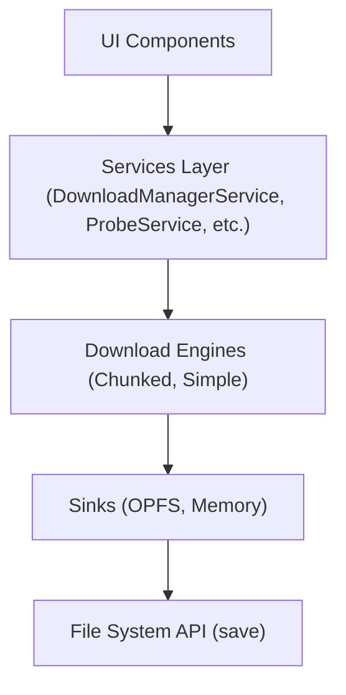

# @alfresco/adf-download-manager

> Queue-based download/upload manager for Alfresco Content Application (ACA) that reliably handles **files of any size**

[](https://opensource.org/licenses/Apache-2.0)

## Features

**Large File Support**: Download files of any size reliably  
**Pause & Resume**: Stop and restart downloads without losing progress  
**Queue Management**: Download multiple files concurrently (configurable parallelism)  
**Progress Tracking**: Real-time progress bar, speed (MB/s), and ETA  
**ZIP Downloads**: Multi-select files or folders -> download as ZIP  
**Persistence**: Paused/queued downloads survive page reloads (localStorage)  
**Streaming Uploads**: Upload large files without browser heap pressure  
**Error Handling**: Automatic retry with exponential backoff  
**Session Recovery**: Detects expired auth, pauses downloads, resumes after re-login  
**Browser Compatibility**: Works on all modern evergreen browsers with graceful degradation

**Tested with:** Multi-gigabyte files on Chrome, Firefox, Edge, Safari 17+

## Overview

The ADF Download Manager solves Alfresco's **~1 GB download ceiling** by combining:

1. **Chunked downloads**: Splits large files into 64 MB pieces via HTTP Range requests
2. **OPFS disk staging**: Streams directly to disk (no browser heap pressure)
3. **Server-side streaming addon**: Optional repository addon for server-side optimization

See the [Architecture document](ARCHITECTURE.md) for technical deep-dive.

## Requirements

| Dependency | Version |
|------------|---------|
| Angular | 17+ |
| `@alfresco/adf-core` | 6.x |
| `@alfresco/adf-extensions` | 6.x |
| `@ngrx/effects` | 17+ |
| `@ngx-translate/core` | 15+ |
| Angular Material | 17+ |
| TypeScript | 5.x |
| Node.js | 24.x (for build) |

### Browser Requirements

- **Required:** Fetch API, Streams API, HTTP Range support
- **Recommended:** OPFS (Origin Private File System) for unlimited file size
- **Fallback:** In-memory buffer with 900 MB cap for browsers without OPFS

## Installation

### Option 1: npm Package (Recommended - Coming Soon)

```sh
npm install @alfresco/adf-download-manager
```

**Note:** npm package publication is planned for v1.1. Currently the library is source-only.

### Option 2: Source Integration (Current)

For detailed source integration instructions, see the [Integration Guide](../../INTEGRATION-GUIDE.md).

**Quick summary:**

1. Copy library source to your project
2. Configure TypeScript path mapping in `tsconfig.json`
3. Configure asset copying in `angular.json`
4. Register the provider

## Quick Start

### 1. Register the Provider

```typescript
// app.config.ts or extensions.module.ts
import { provideAdfDownloadManagerExtension } from '@alfresco/adf-download-manager';

export const appConfig: ApplicationConfig = {
  providers: [
    // ... your existing providers
    ...provideAdfDownloadManagerExtension()
  ]
};
```

### 2. Configure Assets (angular.json)

```json
{
  "projects": {
    "your-app": {
      "architect": {
        "build": {
          "options": {
            "assets": [
              {
                "glob": "**/*",
                "input": "projects/adf-download-manager/src/lib/i18n",
                "output": "/assets/adf-download-manager/i18n"
              },
              {
                "glob": "adf-download-manager.plugin.json",
                "input": "projects/adf-download-manager/src/lib",
                "output": "/assets/plugins"
              }
            ]
          }
        }
      }
    }
  }
}
```

### 3. Use in Your Application

The library automatically integrates with ACA's extension system:

- **Toolbar buttons**: "Download", "Download as ZIP"
- **Context menu**: Right-click file -> "Add to Download Manager"
- **Sidebar panels**: Downloads and Uploads tabs

## Configuration

Override defaults by providing a configuration object:

```typescript
import { DOWNLOAD_MANAGER_CONFIG } from '@alfresco/adf-download-manager';

{
  provide: DOWNLOAD_MANAGER_CONFIG,
  useValue: {
    maxParallelDownloads: 3,              // Concurrent downloads (default: 3)
    largeSizeThreshold: 104_857_600,      // 100 MB: use chunked above this
    chunkSizeBytes: 67_108_864,           // 64 MB: chunk size for Range requests
    warnSizeThreshold: 2_147_483_648,     // 2 GB: confirm before starting
    blockSizeThreshold: null,             // null = unlimited (default)
    inMemoryMaxBytes: 943_718_400,        // 900 MB: memory cap for no-OPFS browsers
    retryDelayMs: 2000,                   // Initial retry delay (default: 2000)
    retryMaxDelayMs: 30_000,              // Max retry delay (default: 30000)
    retryMaxAttempts: 5,                  // Max retry attempts (default: 5)
    useStreamingAddon: true,              // Detect and prefer addon endpoint
    zipPollIntervalMs: 3000,              // ZIP polling interval (default: 3000)
    requestPersistentStorage: true        // Request OPFS eviction protection
  }
}
```

### Configuration Options Reference

| Option | Type | Default | Description |
|--------|------|---------|-------------|
| `maxParallelDownloads` | number | 3 | Max concurrent downloads |
| `largeSizeThreshold` | number | 100 MB | Use chunked mode above this size |
| `chunkSizeBytes` | number | 64 MB | Size of each Range request chunk |
| `warnSizeThreshold` | number | null | Show confirmation dialog above this size |
| `blockSizeThreshold` | number | null | Hard block above this size (null = unlimited) |
| `inMemoryMaxBytes` | number | 900 MB | Memory cap for browsers without OPFS |
| `retryDelayMs` | number | 2000 | Initial retry delay (exponential backoff) |
| `retryMaxDelayMs` | number | 30000 | Max retry delay |
| `retryMaxAttempts` | number | 5 | Max retry attempts before failing |
| `useStreamingAddon` | boolean | true | Detect and prefer streaming addon |
| `addonDownloadPath` | string | (see config) | Addon endpoint path |
| `zipPollIntervalMs` | number | 3000 | Polling interval for ZIP creation |
| `requestPersistentStorage` | boolean | true | Request OPFS persistence |

## API Reference

### DownloadManagerService

**Root singleton** that manages the download queue.

#### Methods

```typescript
// Queue management
downloadFile(nodeId: string, fileName: string, totalBytes: number): string
downloadZip(nodeIds: string[], fileName: string): string
downloadFolder(folderId: string, folderName: string): string

// Task control
pause(taskId: string): void
resume(taskId: string): Promise<void>
cancel(taskId: string): void
retry(taskId: string): Promise<void>

// Bulk operations
pauseAll(): void
resumeAll(): void
clearCompleted(): void

// Auth recovery
resumeAfterAuth(taskId: string): void
```

#### Observables

```typescript
// Subscribe to queue changes
tasks$: Observable<DownloadTask[]>

// Example usage
downloadManager.tasks$.subscribe(tasks => {
  const active = tasks.filter(t => t.status === 'active');
  const paused = tasks.filter(t => t.status === 'paused');
  console.log(`Active: ${active.length}, Paused: ${paused.length}`);
});
```

### DownloadTask Model

```typescript
interface DownloadTask {
  id: string;
  nodeId: string;
  fileName: string;
  type: 'node' | 'version' | 'node-zip' | 'folder-zip';
  totalBytes: number | null;
  downloadedBytes: number;
  status: DownloadStatus;
  versionId?: string;
  rangeSupported: boolean | null;
  etag: string | null;
  retryCount: number;
  tempFileName: string | null;
  error?: DownloadError;
  speedBytesPerSec: number;
  startedAt: Date | null;
}

type DownloadStatus = 
  | 'queued' 
  | 'active' 
  | 'paused' 
  | 'retrying' 
  | 'completed' 
  | 'failed' 
  | 'cancelled';
```

### UploadManagerService

**Upload queue manager** (similar API to DownloadManagerService).

```typescript
// Queue management
enqueue(files: File[], parentNodeId: string): void

// Task control
pause(taskId: string): void
resume(taskId: string): Promise<void>
cancel(taskId: string): void
retry(taskId: string): Promise<void>

// Observable
tasks$: Observable<UploadTask[]>
```

## Components

### DownloadManagerPanelComponent

Renders the download queue sidebar panel.

```typescript
import { DownloadManagerPanelComponent } from '@alfresco/adf-download-manager';

@Component({
  template: `
    <adf-download-manager-panel></adf-download-manager-panel>
  `
})
```

**No inputs**: reads from `DownloadManagerService` automatically.

### UploadManagerPanelComponent

Renders the upload queue sidebar panel.

```typescript
import { UploadManagerPanelComponent } from '@alfresco/adf-download-manager';

@Component({
  template: `
    <adf-upload-manager-panel 
      [parentNodeId]="'-my-'">
    </adf-upload-manager-panel>
  `
})
```

**Inputs:**
- `[parentNodeId]`: Target folder (default: `'-my-'`)

### DownloadManagerButtonComponent

Toolbar/inline download button.

```typescript
import { DownloadManagerButtonComponent } from '@alfresco/adf-download-manager';

@Component({
  template: `
    <adf-download-manager-button 
      [node]="selectedNode"
      [nodes]="selectedNodes">
    </adf-download-manager-button>
  `
})
```

**Inputs:**
- `[node]`: Single file or folder
- `[nodes]`: Multi-selection (shows ZIP button when `length > 1`)

### UploadManagerButtonComponent

Upload button with drag-and-drop support.

```typescript
import { UploadManagerButtonComponent } from '@alfresco/adf-download-manager';

@Component({
  template: `
    <adf-upload-manager-button 
      [parentNodeId]="currentFolderId">
    </adf-upload-manager-button>
  `
})
```

## Architecture

For a complete technical deep-dive, see **[ARCHITECTURE.md](ARCHITECTURE.md)**.

### High-Level Overview



**Key concepts:**

1. **Probe Phase**: HEAD request before downloading to detect file size, Range support, addon availability
2. **Engine Selection**: Chunked mode for large files, simple mode for small files
3. **Sink Selection**: OPFS for large files (disk-backed), memory for small files
4. **Resume Mechanism**: ETag validation + disk offset verification before resuming

## Browser Support

| Browser | OPFS Support | Max File Size |
|---------|--------------|---------------|
| Chrome 119+ | Full | Unlimited* |
| Firefox 111+ | Full | Unlimited* |
| Edge 119+ | Full | Unlimited* |
| Safari 17+ | Full | Unlimited* |
| Safari 16.4-16.9 | [!] Partial | Unlimited* |
| iOS Safari | [x] No | 900 MB (memory cap) |

\* *Subject to browser storage quota (typically 50-80% of available disk)*

### Progressive Enhancement

- **Optimal:** OPFS available -> Disk-backed streaming, unlimited size
- **Degraded:** No OPFS -> In-memory buffer, 900 MB cap
- **Minimal:** No Range support -> Simple download, no pause/resume

## Integration Guide

For step-by-step integration instructions, see:

**[Integration Guide](../../INTEGRATION-GUIDE.md)**: Complete setup walkthrough  
**[Architecture](ARCHITECTURE.md)**: Technical deep-dive  
**[Getting Started](../../GETTING-STARTED.md)**: Run the demo stack

## Repository Addon (Optional but Recommended)

The **streaming download addon** is a server-side component that optimizes large-file downloads. It is a **separate project**, not part of this repository:

**Repository:** https://github.com/aborroy/alfresco-download-streaming-repo

**Benefits:**
- Server-side streaming with bounded buffers (no heap allocation)
- HTTP Range support at source
- O(1) seek for instant resume

**Installation:**

```dockerfile
ARG ADDON_VERSION=1.0.0
FROM alfresco/alfresco-content-repository-community:26.1.0
ADD --chown=alfresco:Alfresco --chmod=644 \
    https://github.com/aborroy/alfresco-download-streaming-repo/releases/download/v${ADDON_VERSION}/alfresco-download-streaming-repo-${ADDON_VERSION}.jar \
    /usr/local/tomcat/webapps/alfresco/WEB-INF/lib/alfresco-download-streaming-repo.jar
```

The library **auto-detects** the addon and prefers it when available. If missing, it falls back to chunked Range requests against the standard ACS content API.

## Examples

### Example 1: Programmatic Download

```typescript
import { Component, inject } from '@angular/core';
import { DownloadManagerService } from '@alfresco/adf-download-manager';

@Component({
  selector: 'app-file-downloader',
  template: `<button (click)="downloadLargeFile()">Download Large File</button>`
})
export class FileDownloaderComponent {
  private downloadManager = inject(DownloadManagerService);
  
  downloadLargeFile() {
    const nodeId = 'abc-123';
    const fileName = 'large-cad-file.step';
    const totalBytes = 4_000_000_000; // example: a multi-gigabyte file
    
    const taskId = this.downloadManager.downloadFile(nodeId, fileName, totalBytes);
    
    // Subscribe to progress
    this.downloadManager.tasks$.subscribe(tasks => {
      const task = tasks.find(t => t.id === taskId);
      if (task) {
        console.log(`Progress: ${task.downloadedBytes}/${task.totalBytes}`);
        console.log(`Speed: ${task.speedBytesPerSec / 1_000_000} MB/s`);
      }
    });
  }
}
```

### Example 2: Bulk Operations

```typescript
pauseAllDownloads() {
  this.downloadManager.pauseAll();
}

resumeAllDownloads() {
  this.downloadManager.resumeAll();
}

clearCompletedDownloads() {
  this.downloadManager.clearCompleted();
}
```

### Example 3: Session Recovery

```typescript
// After successful re-authentication
authService.onLogin.subscribe(() => {
  const pausedTasks = this.downloadManager.tasks$.value
    .filter(t => t.status === 'paused' && t.error?.code === 'AUTH_FAILED');
  
  pausedTasks.forEach(task => {
    this.downloadManager.resumeAfterAuth(task.id);
  });
});
```

## Internationalization

The library ships with English translations. Add your own language files:

```json
{
  "ADF_DOWNLOAD_MANAGER": {
    "PANEL": {
      "TITLE": "Downloads",
      "EMPTY": "No downloads"
    },
    "ACTIONS": {
      "PAUSE": "Pause",
      "RESUME": "Resume",
      "CANCEL": "Cancel"
    }
  }
}
```

Place at `assets/adf-download-manager/i18n/{lang}.json`